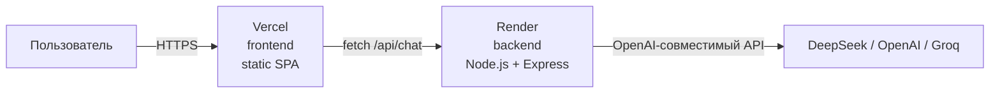

# Деплой в интернет (Шаг 10)

Как развернуть AI-симулятор логических схем онлайн: frontend на **Vercel**, backend на **Render** (или Railway).

---

## Архитектура

- **Frontend** (Vite + React) → **Vercel** (бесплатно, статика).
- **Backend** (Express) → **Render** (Web Service) или **Railway**.
- **LLM** → облачный провайдер с API-ключом.

> **Важно:** локальная **Ollama в облаке не работает** — там нет `localhost:11434`.
> Для онлайна нужен облачный OpenAI-совместимый провайдер с ключом.

---

## Часть 1. Деплой фронтенда на Vercel

### 1.1. Подготовка

Фронтенд уже готов: `frontend/src/api/baseUrl.ts` читает `VITE_API_BASE_URL`.
В dev переменная пустая → работает прокси Vite.
В prod переменная = URL бэкенда на Render.

### 1.2. Настройки в панели Vercel

1. Зарегистрируйтесь на https://vercel.com (через GitHub).
2. **Add New → Project** → импортируйте репозиторий.
3. Настройки проекта:
   - **Root Directory:** *(корень репозитория, не `frontend`)*
   - **Framework Preset:** Vite
   - **Build Command:** `npm run build:shared && npm run build:frontend`
   - **Output Directory:** `frontend/dist`
   - **Install Command:** `npm install`
4. **Environment Variables** (Settings → Environment Variables):
   - `VITE_API_BASE_URL` = URL бэкенда (получите после деплоя backend, см. Часть 3).
5. **Deploy**.

> **Почему Root Directory = корень:** `@logic/shared` находится вне папки `frontend`.
> Vercel по умолчанию не собирает workspaces выше Root Directory.
> Сборка из корня использует npm workspaces как задумано.

### 1.3. Проверка

После деплоя откройте `https://<ваш-проект>.vercel.app` — должна открыться страница симулятора.
(Чат не заработает, пока не развёрнут backend и не задан `VITE_API_BASE_URL`.)

---

## Часть 2. Деплой бэкенда на Render

### 2.1. Требуется облачный LLM-ключ

Ollama в облаке недоступна. Получите ключ у одного из провайдеров:

| Провайдер | Где взять ключ | Бесплатный тариф |
|-----------|----------------|------------------|
| **Groq** | https://console.groq.com | Да, щедрый free tier |
| **DeepSeek** | https://platform.deepseek.com | Нет (нужен баланс) |
| **OpenRouter** | https://openrouter.ai | Есть бесплатные модели |
| **OpenAI** | https://platform.openai.com | Нет |

**Рекомендую Groq** для бесплатного старта: быстрый, OpenAI-совместимый.

### 2.2. Создание Web Service в Render

1. Зарегистрируйтесь на https://render.com (через GitHub).
2. **New → Web Service** → подключите репозиторий.
3. Настройки:
   - **Name:** `logic-backend`
   - **Region:** ближайший к вам
   - **Branch:** `main`
   - **Root Directory:** *(пусто — корень репозитория)*
   - **Runtime:** Node
   - **Build Command:** `npm install && npm run build:shared && npm run build:backend`
   - **Start Command:** `node backend/dist/server.js`
   - **Health Check Path:** `/api/health`
   - **Instance Type:** Free
4. **Environment Variables** (Advanced → Add Environment Variable):
   - `LLM_API_KEY` = ваш ключ
   - `LLM_BASE_URL` = `https://api.groq.com/openai/v1` (или DeepSeek/OpenAI)
   - `LLM_MODEL` = `llama-3.3-70b-versatile` (Groq) / `deepseek-chat` / `gpt-4o-mini`
   - `LLM_TIMEOUT_MS` = `60000`
   - `CORS_ORIGIN` = `https://<ваш-проект>.vercel.app`
5. **Create Web Service**.

> **Про PORT:** Render сам задаёт переменную `PORT`. Наш `config.ts` читает `process.env.PORT` —
> ничего менять не нужно, Render передаст свой порт автоматически. ✅

### 2.3. Проверка backend

Откройте `https://logic-backend.onrender.com/api/health` — должно быть `{"status":"ok"}`.

---

## Часть 3. Связывание frontend и backend

1. Скопируйте URL бэкенда из Render (например, `https://logic-backend.onrender.com`).
2. В Vercel → Settings → Environment Variables → `VITE_API_BASE_URL` = этот URL.
3. **Redeploy** фронтенд (Deployments → ⋯ → Redeploy), чтобы Vite перечитал переменную.
4. В Render обновите `CORS_ORIGIN` = URL фронтенда на Vercel.
5. Проверьте чат на сайте Vercel.

---

## Часть 4. Альтернатива: Railway

Railway проще Render, но бесплатный тариф ограничен (500 часов/мес).

1. https://railway.app → **New Project → Deploy from GitHub repo**.
2. Railway сам определит Node-проект.
3. **Settings → Build:**
   - Build Command: `npm install && npm run build:shared && npm run build:backend`
   - Start Command: `node backend/dist/server.js`
4. **Variables:** те же, что для Render.
5. Railway сам выдаст домен и подставит `PORT`.

---

## Часть 5. Чек-лист перед деплоем

- [ ] Удалена папка `backend/scripts/` (диагностические `.mjs`).
- [ ] Удалён `result.txt`, `tmp-request.json`, `resp.json` из корня.
- [ ] `backend/.env` НЕ в репозитории (только `.env.example`).
- [ ] `frontend/.env.local` НЕ в репозитории.
- [ ] `.gitignore` содержит `node_modules`, `dist`, `.env`, `.env.local`.
- [ ] `package-lock.json` закоммичен.
- [ ] `frontend/src/api/baseUrl.ts` создан.
- [ ] `chatApi.ts` использует `apiUrl('/api/chat')`.

---

## Часть 6. Типичные ошибки деплоя

| Ошибка | Причина | Решение |
|--------|---------|---------|
| `Cannot find module '@logic/shared'` | shared не собран | добавьте `npm run build:shared` в Build Command |
| `CORS blocked` | `CORS_ORIGIN` не совпадает с доменом Vercel | укажите точный URL Vercel в Render |
| `404 /api/chat` на Vercel | нет `VITE_API_BASE_URL` | задайте переменную и сделайте Redeploy |
| `504 Timeout` | LLM медленный | увеличьте `LLM_TIMEOUT_MS`, возьмите модель полегче |
| `401 Unauthorized` | неверный `LLM_API_KEY` | проверьте ключ в Render Variables |
| `Application failed to respond` (Render) | `start` неверный | Start Command = `node backend/dist/server.js` |
| Долгий cold start (Render Free) | сервис засыпает через 15 мин | норма для бесплатного тарифа |

---

## Часть 7. Что НЕ работает при локальной Ollama

Если оставить Ollama, backend в облаке не запустится — он не найдёт `localhost:11434`.

**Варианты:**
1. **Облачный LLM** (рекомендуется для продакшена).
2. **Туннель** (ngrok) к локальной Ollama — работает только пока ваш компьютер включён. Не для продакшена.
3. **Гибрид:** backend локально, frontend на Vercel — тогда `VITE_API_BASE_URL` = URL туннеля к локальному backend.

Для учебного проекта достаточно **варианта 1** (Groq — бесплатно).
